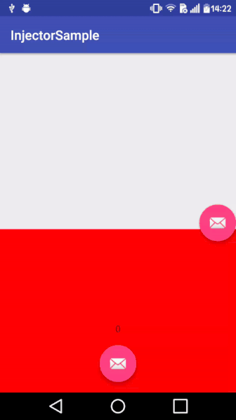

InjectorLib
===========

This library allows you to save any primitive, Serializable or Parcelable type objects.

## Integration with Gradle

```
    compile 'com.azoft.injector:injector:0.9'
```

To work with this library you should:
* Create Injector instance with Injector.init call;
* Call injector.applyRestoreInstanceState(Bundle) with null or bundle object from your Activity or Fragment instance;
* Call injector.applyOnSaveInstanceState() with bundle object from your Activity or Fragment instance;

Basicly you should create base class, do steps above and Injector will work with any subclass of this base class.

# Example of ussage

```
	public class DataActivity extends BaseActivity {

		@InjectSavedState
	    private Double mValue;

	    @Override
	    protected void onCreate(final Bundle savedInstanceState) {
	        super.onCreate(savedInstanceState);

	        if (null == mValue) {
	        	mValue = // do init here
	        }
	        performValueWork(mValue);
	    }
	}
```




# Bellow are examples of Base classes creation.

# Example of usage with Activity.

```
	public class BaseActivity extends Activity {

	    private final Injector mInjector = Injector.init(getClass());

	    @Override
	    protected void onCreate(final Bundle savedInstanceState) {
	        super.onCreate(savedInstanceState);

	        mInjector.applyRestoreInstanceState(this, savedInstanceState);
	    }

	    @Override
	    protected void onSaveInstanceState(final Bundle outState) {
	        super.onSaveInstanceState(outState);
	        mInjector.applyOnSaveInstanceState(this, outState);
	    }
	}
```

# Example of usage with Fragment.

```
	public class BaseFragment extends Fragment {

	    private final Injector mInjector = Injector.init(getClass());

	    @Override
	    public void onCreate(final Bundle savedInstanceState) {
	        super.onCreate(savedInstanceState);

	        mInjector.applyRestoreInstanceState(this, savedInstanceState);
	    }

	    @Override
	    public void onSaveInstanceState(final Bundle outState) {
	        super.onSaveInstanceState(outState);

	        mInjector.applyOnSaveInstanceState(this, outState);
	    }
    }
```

# Example of usage with View.

```
	public class BaseCustomView extends View {

        private final Injector mInjector = Injector.init(getClass());

	    @Override
	    protected void onRestoreInstanceState(final Parcelable state) {
	        if (state instanceof InjectorViewSaveState) {
	            final InjectorViewSaveState injectorViewSaveState = (InjectorViewSaveState) state;

	            mInjector.applyRestoreInstanceState(this, injectorViewSaveState.getOurSaveState());

	            super.onRestoreInstanceState(injectorViewSaveState.getSuperState());
	        } else {
	            super.onRestoreInstanceState(state);
	        }
	    }

	    @Override
	    protected Parcelable onSaveInstanceState() {
	        return new InjectorViewSaveState(mInjector, this, super.onSaveInstanceState());
	    }
    }
```

# Example of usage with any other Objects.

```
	public class AnyObject {

        private final Injector mInjector = Injector.init(getClass());

	    protected final void onRestoreInstanceState(final Bundle state) {
            mInjector.applyRestoreInstanceState(this, state);
	    }

	    protected final void onSaveInstanceState(final Bundle outState) {
	        mInjector.applyOnSaveInstanceState(outState);
	    }
    }
```

# Custom tags

Custom tag for Bundle can be generated by implementing InjectSaveStateTag. It is usefull for multiply instances of the same ViewModels or Views that can be instantiated on the screen.